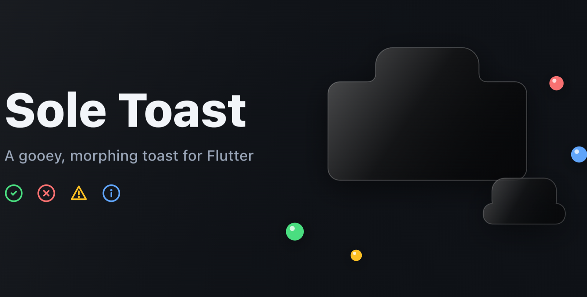
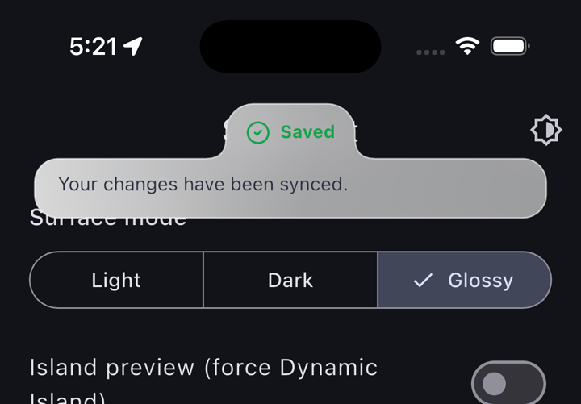
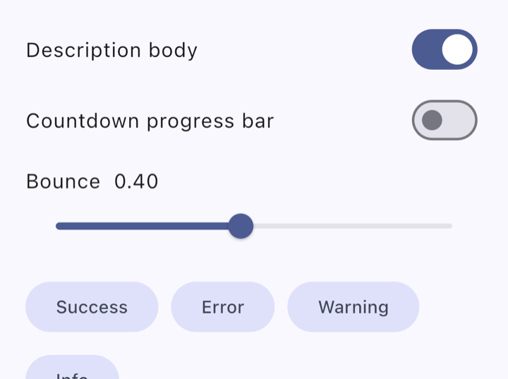
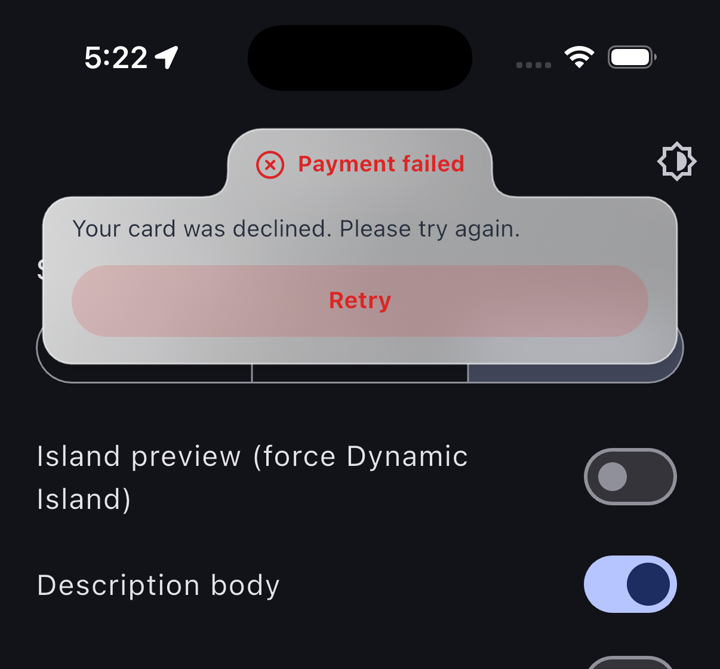
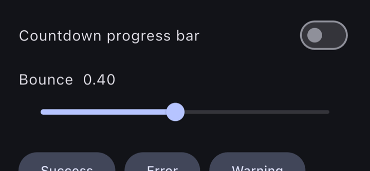
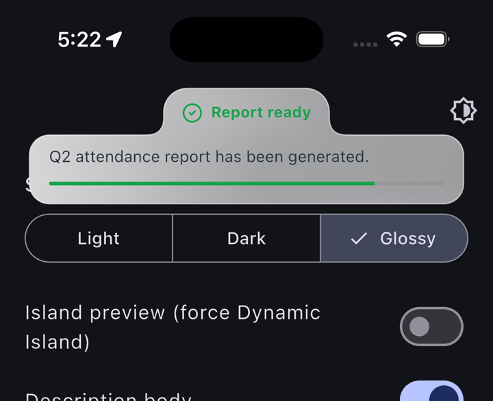
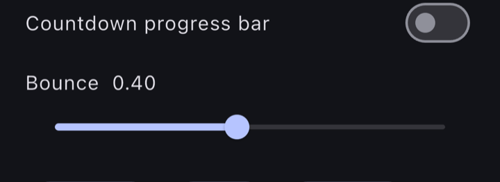
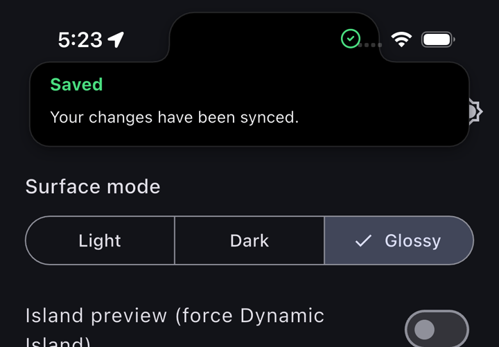
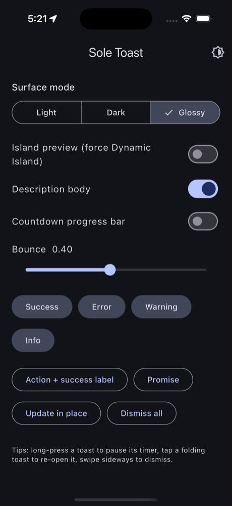

<p align="center">
  
</p>

# Sole Toast

[](https://pub.dev/packages/sole_toast)
[](LICENSE)


A gooey, morphing toast for Flutter. A compact pill lands on screen, the body
**melts** out of it with an organic blob morph, and after a few seconds it
folds itself back up and slips away — driven by physics-based springs, a
landing squish, and an iPhone **Dynamic Island** choreography.

**Zero runtime dependencies.** No assets, no icon fonts, no third-party
packages — every shape, icon, and animation is painted and simulated with
Flutter primitives. Even the banner above was rendered by the library's own
blob engine.

## Gallery

Real, unedited captures from the example app on an iPhone 16 Pro.

<table>
  <tr>
    <td align="center"><b>Glossy · success</b></td>
    <td align="center"><b>Light · info</b></td>
    <td align="center"><b>Dark · warning</b></td>
  </tr>
  <tr>
    <td></td>
    <td></td>
    <td></td>
  </tr>
  <tr>
    <td align="center"><b>Error + action button</b></td>
    <td align="center"><b>Promise (loading pill)</b></td>
    <td align="center"><b>Countdown progress</b></td>
  </tr>
  <tr>
    <td></td>
    <td></td>
    <td></td>
  </tr>
</table>

### The Dynamic Island choreography

<table>
  <tr>
    <td align="center"><b>1 — icon docks beside the island</b></td>
    <td align="center"><b>2 — the sheet melts down beneath it</b></td>
  </tr>
  <tr>
    <td></td>
    <td></td>
  </tr>
</table>

---

## Table of contents

- [Gallery](#gallery)
- [Platform support](#platform-support)
- [Features](#features)
- [Installation](#installation)
- [Setup](#setup)
- [Quick start](#quick-start)
- [API reference](#api-reference)
- [Configuration](#configuration)
- [Surface modes](#surface-modes)
- [Dynamic Island](#dynamic-island)
- [Interactions & accessibility](#interactions--accessibility)
- [How it works](#how-it-works)
- [FAQ](#faq)
- [Credits](#credits)
- [License](#license)

## Platform support

Sole Toast is pure Dart/Flutter — no native code, no platform channels, no
plugins — so it runs on **every platform Flutter targets**:

| Android | iOS | Web | macOS | Windows | Linux |
| :-: | :-: | :-: | :-: | :-: | :-: |
| ✅ | ✅ | ✅ | ✅ | ✅ | ✅ |

Platform notes: the **Dynamic Island choreography** activates automatically
only on island iPhones (everywhere else the standard top-center drop is
used — or force the island preview with `SoleIslandMode.always`). **Haptics**
fire where the OS supports them and no-op silently elsewhere. The **glossy**
backdrop blur renders on all platforms with Flutter's default renderer.

## Features

- **Organic pill → blob morph** — the background is a parametric path
  regenerated every frame, so the body genuinely *grows out of* the pill and
  text never reflows mid-animation.
- **Semantic types** — `success`, `error`, `warning`, `info`. The accent
  color, stroke-drawn icon, and action-button tint all derive from the type.
- **Three surface modes** — `light`, `dark`, and `glossy`: a frosted hybrid
  (backdrop blur + translucent tint + specular sheen + hairline border) that
  adapts to the app's brightness.
- **Dynamic Island choreography** — on island iPhones the toast docks to the
  hardware cutout: the icon appears beside the island, then a black sheet
  slides down beneath it revealing the title and content. Auto-detected, can
  be forced for demos or disabled entirely.
- **Physics everywhere** — expand/collapse springs, a landing squish, a
  header squish, an error shake, icon draw-in strokes, and a single `bounce`
  dial (0.05–0.8) that tunes them all. Presets: `smooth`, `bouncy`,
  `subtle`, `snappy`.
- **Promise toasts** — spinner → success/error morph; in-place `update()`;
  action buttons with an optional success-label morph-back.
- **Mobile-first interactions** — swipe to dismiss, tap a folding toast to
  re-open it, long-press to pause the timer.
- **Considerate by default** — stacking with a FIFO queue, optional
  countdown progress bar and timestamps, reduced-motion support,
  screen-reader announcements, optional haptics.

## Installation

```bash
flutter pub add sole_toast
```

Or add it to `pubspec.yaml` manually:

```yaml
dependencies:
  sole_toast: ^0.1.0
```

## Setup

Mount the toast layer once, at the root of your app:

```dart
import 'package:sole_toast/sole_toast.dart';

MaterialApp(
  builder: SoleToast.init(),
  home: const HomePage(),
);
```

Already using `builder` (for example `EasyLoading.init()` or a text-scale
override)? Chain it:

```dart
MaterialApp(
  builder: SoleToast.init(builder: yourExistingBuilder),
);
```

## Quick start

```dart
SoleToast.success('Saved', description: 'Your changes have been synced.');

SoleToast.error('Payment failed',
    description: 'Your card was declined. Please try again.');

SoleToast.warning('Storage almost full');

SoleToast.info('Share link ready',
    description: 'Your link has been generated.',
    action: SoleToastAction(
      label: 'Copy to clipboard',
      successLabel: 'Copied!',   // morphs back to a pill saying this
      onPressed: copyLink,
    ));
```

## API reference

### Methods

| Method | Description |
| --- | --- |
| `SoleToast.show(title, …)` | Shows a toast (defaults to `info`). Returns its id. |
| `SoleToast.success / error / warning / info(title, …)` | Type-specific shorthands. |
| `SoleToast.promise<T>(future, loading:, success:, error:, …)` | Spinner toast that morphs when the future settles. Returns the future's value; errors rethrow. |
| `SoleToast.update(id, …)` | Mutates a visible or queued toast in place (title, description, type, action). |
| `SoleToast.dismiss([id])` | Folds up one toast — or every toast when called without an id. |
| `SoleToast.dismissByType(type)` | Dismisses all visible and queued toasts of one type. |
| `SoleToast.dismissAll()` | Alias for `dismiss()`. |
| `SoleToast.init({builder})` | Returns the `TransitionBuilder` that mounts the layer. |
| `SoleToast.config` | Read/assign the global [`SoleToastConfig`](#configuration). |

### Per-toast options

| Option | Type | Description |
| --- | --- | --- |
| `description` | `String?` | Body text revealed by the blob morph. |
| `action` | `SoleToastAction?` | Full-width button in the body. `successLabel` morphs the toast back to a pill after the tap. |
| `duration` | `Duration?` | Total on-screen time (overrides config). |
| `mode` | `SoleToastMode?` | Surface override for this toast only. |
| `showProgress` | `bool?` | Countdown bar override. |
| `id` | `Object?` | Custom id (otherwise generated). |
| `onDismiss` | `VoidCallback?` | Fires once the toast has left the screen. |

## Configuration

```dart
SoleToast.config = const SoleToastConfig(
  mode: SoleToastMode.glossy,            // light | dark | glossy
  position: SoleToastPosition.topCenter, // topCenter | bottomCenter
  islandMode: SoleIslandMode.auto,       // auto | always | never
  bounce: 0.4,                           // 0.05 subtle … 0.8 jelly
  spring: true,                          // false → smooth ease curves
  displayDuration: Duration(seconds: 4),
  maxVisible: 3,                         // extras wait in a FIFO queue
  gap: 12,                               // px between stacked toasts
  pillHeight: 38,
  showProgress: false,
  showTimestamp: false,
  enableHaptics: true,
);

// Or start from a preset:
SoleToast.config = SoleToastConfig.preset(SoleToastPreset.bouncy);
```

## Surface modes

| Mode | Surface | Best for |
| --- | --- | --- |
| `light` | Solid white, soft shadows | Light apps, the classic look |
| `dark` | Solid near-black | Dark apps |
| `glossy` | Backdrop blur + translucent tint + sheen + hairline border; follows the app's brightness | A frosted-glass look over any content |

The Dynamic Island capsule always renders pure black — it must blend with
the hardware cutout — regardless of mode.

## Dynamic Island

On iPhones with a Dynamic Island (detected automatically in portrait via the
59 pt top view padding), toasts dock to the cutout instead of dropping from
the top edge:

1. A black capsule hugs the island and grows a lobe to the side, revealing
   the type icon **beside the island** (the space next to the cutout is
   shared with the system clock and battery, so the capsule stays compact
   and never collides with them).
2. A black sheet **slides down** beneath the island with the gooey morph,
   revealing the **title** first…
3. …then the **description and action**, expanded-Live-Activity style. On
   dismiss it folds back up into the island.

While a toast is docked, showing another one morphs the capsule in place
rather than stacking — the island is a single-slot surface.

```dart
// Preview the choreography anywhere (Android, simulator, tablets):
SoleToast.config =
    SoleToast.config.copyWith(islandMode: SoleIslandMode.always);

// Opt out entirely:
SoleToast.config =
    SoleToast.config.copyWith(islandMode: SoleIslandMode.never);
```

## Interactions & accessibility

- **Swipe** a toast sideways to dismiss it (follows your finger, fades out).
- **Tap** a toast while it is folding up to re-open it and restart its timer.
- **Long-press** to hold a toast on screen; release to resume.
- **Reduced motion** — when the platform requests it, springs and squishes
  are replaced with near-instant transitions.
- **Screen readers** — every toast is announced (assertively for errors and
  warnings), and toasts are live-region semantic nodes.
- **Haptics** — a light impact on show, a medium impact with the error
  shake, and a selection click on action taps (disable with
  `enableHaptics: false`).

## The example app



The [example](example/) is a full playground: switch between the three
surface modes, force the Dynamic Island preview on any device, toggle the
description body and countdown progress bar, drag the bounce slider from
subtle to jelly, and fire every variant — including the action button with
a success-label morph-back, a promise toast, and an in-place update.

```bash
cd example
flutter create .   # one-time: generates ios/ and android/
flutter run
```

On iPhones with a real Dynamic Island the choreography activates
automatically — a welcome toast plays on launch.

<br clear="right"/>

## How it works

The blob is not a rounded rectangle being resized. Each frame, a parametric
path function receives the pill width, the body width, the total height and
a morph progress `t`, and emits a single closed path: at `t = 0` a pure
capsule; as `t → 1` the body swells out beneath the pill, joined by an
organic quadratic junction curve. Content is laid out at its final size from
the start, measured offstage, and revealed by an animated clip — which is
why text never reflows while the blob is moving.

Springs are real physics simulations (`SpringSimulation`), not tweened
curves: the expand, collapse, squish, resize and drag-return all share one
`bounce` parameter mapped to stiffness/damping/mass, so the whole toast
feels like one material. The package is a few small files — a path builder,
a painter, one stateful card, and a tiny queue manager — with no runtime
dependencies to audit or version-match.

## FAQ

**Why the `builder:` setup instead of a context parameter?**
The layer mounts once above the whole app, so `SoleToast.success(…)` works
from anywhere — services, controllers, timers, after navigation — without
threading a `BuildContext` through your code.

**Does it work with any fonts / themes?**
Toast text uses your ambient `Directionality` and inherits nothing else by
design — the type styles are self-contained so toasts look identical across
apps. Colors adapt via the mode (and brightness for `glossy`).

**What about tablets, web, desktop?**
Everything works; the Dynamic Island stage simply stays inactive (or force
it with `SoleIslandMode.always` for fun).

## Credits

Sole Toast's morph geometry and animation feel are inspired by — and started
as a Flutter port of — the excellent
**[goey-toast](https://github.com/anl331/goey-toast)** React library by
[anl331](https://github.com/anl331). The engine here is a from-scratch
rebuild on Flutter primitives (`CustomPainter`, `SpringSimulation`, a manual
overlay) with a mobile-first interaction model and the Dynamic Island
choreography added on top. If you build for the web, go check the original —
it's beautiful.

## Author

Built and maintained by **Sohail Ahmad** —
[sohailahmad.com](https://sohailahmad.com) ·
[GitHub @sole-sohail](https://github.com/sole-sohail)

## License

[MIT](LICENSE) © 2026 Sohail Ahmad
